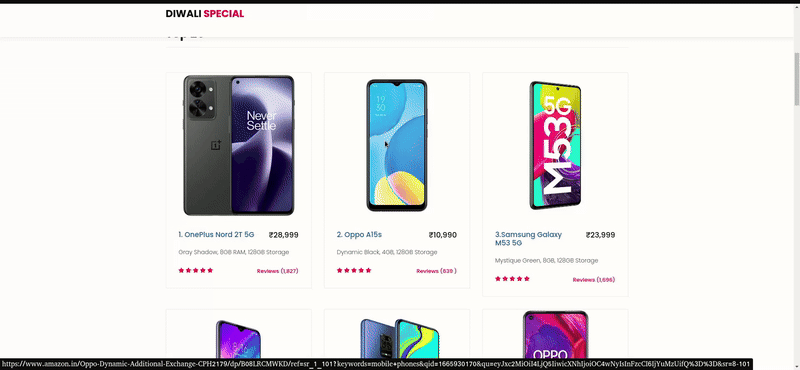

# Mobile Phone Sentiment Analysis and Recommendation System

## Overview
This mini-project performs **sentiment analysis** on reviews of mobile phones sourced from Amazon. It leverages natural language processing (NLP) techniques to analyze customer reviews and determine the sentiment (positive, negative, or neutral). Based on the analysis and sales data, the project recommends the **top 25 best-selling mobile phones**.

## Features
- **Sentiment Analysis**: Analyze customer reviews to classify them into positive, neutral, or negative sentiments.
- **Recommendation System**: Rank and recommend the top 25 mobile phones based on a combination of sentiment scores and sales data.
- **Data Visualization**: Present insights such as the sentiment distribution and ratings using graphs.

## Data Structure
- **Reviews Dataset**: Contains columns like `product_id`, `review_text`, `rating`, and `timestamp`.
- **Sales Data**: Contains columns like `product_id`, `units_sold`, and `revenue`.

## Usage
1. **Data Preprocessing**
   - Ensure the reviews are cleaned (e.g., removing HTML tags, special characters).
   - Tokenize and vectorize text data using NLP tools like NLTK or spaCy.

2. **Sentiment Analysis**
   - Use pre-trained models like `TextBlob`, `VADER`, or a custom-trained model for sentiment classification.

3. **Recommendation Algorithm**
   - Combine sentiment scores and sales data to rank mobile phones.
   - Output the top 25 recommendations.

4. **Visualization**
   - Use libraries like `Matplotlib` or `Seaborn` to create plots showing sentiment trends and rankings.

## Results
- Sentiment distribution: **Positive (70%)**, **Neutral (20%)**, **Negative (10%)**
- Top 25 Mobile Recommendations: Shown in video

## Future Enhancements
- Integrate real-time review fetching via APIs.
- Use deep learning models like BERT for more accurate sentiment classification.
- Add features for dynamic recommendations based on user preferences.

## Requirements
- Python 3.7+
- Libraries: pandas, numpy, nltk, TextBlob, matplotlib, seaborn

### Demo

## Contributors

- Bagiya Lakshmi ([GitHub](https://github.com/bagiyalakshmi))
- Cynddia Balamurugan ([GitHub](https://github.com/bagiyalakshmi))
- Shalini D M ([GitHub](https://github.com/bagiyalakshmi))
- Harini C J ([GitHub](https://github.com/bagiyalakshmi))

